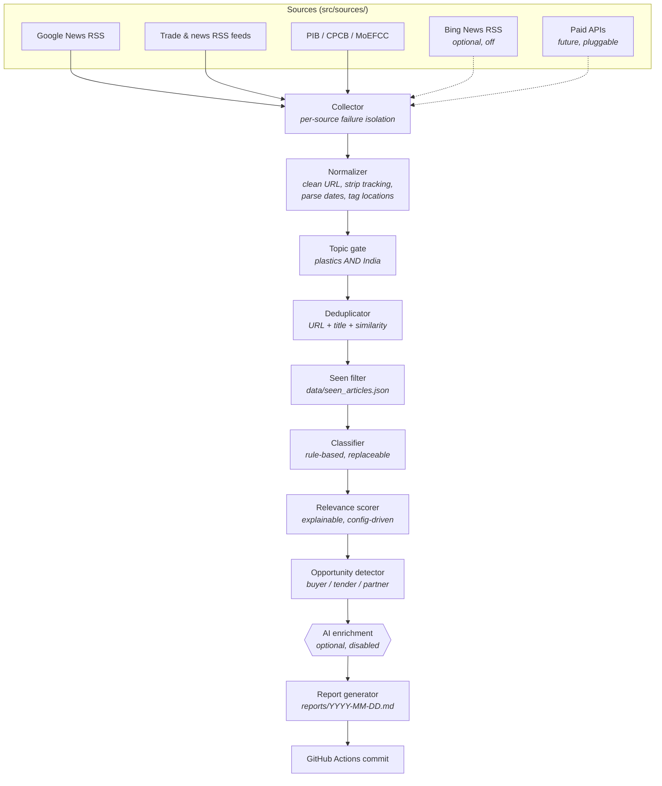

# India Plastic Recycling Intelligence

A daily intelligence agent that tracks plastic-recycling developments across
India and publishes a Markdown briefing to this repository every morning.

It is built for someone evaluating or operating a plastic recycling business in
**Karnataka, specifically the Udupi / Mangaluru coastal belt**. Everything —
the search queries, the scoring weights, the report sections — is tuned to
answer one question each morning: *is there anything here I should act on
today?*

**Free-first by design.** No paid APIs, no API keys, no quotas. Public RSS
feeds, government pages and deterministic Python. The optional AI layer is off
by default and the agent is fully functional without it.

- Latest briefing: [`reports/`](reports/)
- Format example: [`docs/sample-report.md`](docs/sample-report.md) — **fabricated articles from fictional outlets**, used to show the report's shape. Not news.

## Architecture



Each stage lives in its own module with a narrow interface, so any one of them
can be replaced without touching the others. The two most important seams are
the source registry (add a source, change nothing downstream) and the
classifier protocol (swap rules for an LLM, change nothing upstream).

## Data sources

| Source | Module | Notes |
| --- | --- | --- |
| Google News RSS | `src/sources/google_news.py` | One request per configured query, locale `en-IN` / `IN`, restricted to the last two days at the source. |
| News & trade RSS | `src/sources/rss.py` | The Hindu, Business Standard, Economic Times, Down To Earth, Mongabay India, Packaging South Asia, Plastics News, Recycling Today, Waste Management World. |
| Government | `src/sources/government.py` | PIB press releases (RSS) plus CPCB and MoEFCC listing pages (HTML link extraction). Scanned over a wider 7-day window because they publish infrequently. |
| Bing News RSS | `src/sources/bing_news.py` | Included but disabled — it rate-limits hard. Flip `sources.bing_news.enabled` to try it. |

Feeds are listed in `config.yaml`, not in code. Adding a paid API later means
writing one module and registering it in `src/sources/__init__.py`; the
normalizer, deduplicator, classifier, scorer and reporter are unaffected.

## What it monitors

Twenty-five configurable search queries cover plastic recycling in India,
recycling plants and new capacity, recycled granules and the HDPE / PP / LDPE /
PET grades, plastic scrap, recycled-polymer demand and pricing, buyers of
recycled granules, FMCG recycled-content requirements, packaging and automotive
demand, plastic-waste and municipal tenders, EPR, CPCB and MoEFCC updates, the
Plastic Waste Management Rules, recycling machinery and technology, mechanical
and chemical recycling, pyrolysis, investments, acquisitions, new startups,
government schemes and waste-management contracts.

Every article is labelled with one or more categories:

`NEW_PLANT` · `CAPACITY_EXPANSION` · `BUYER` · `SELLER` · `TENDER` ·
`REGULATION` · `PRICE` · `INVESTMENT` · `TECHNOLOGY` · `MACHINERY` · `EPR` ·
`COMPANY_NEWS` · `MARKET` · `OTHER`

Classification is deterministic keyword matching (`src/classify.py`). It is
cheap, reviewable and produces the same answer twice. The `Classifier` protocol
exists so an LLM classifier can replace it later without any other change.

All term matching — the topic gate, the classifier, the scorer and the
opportunity detector — goes through `src/matching.py`, which matches on word
boundaries rather than substrings. This is not a detail. The first live run
used plain substring matching, and `"pp"` matched *app*roves, `"ps"` matched
to*ps*, `"pet"` matched com*pet*ition and `"ban"` matched ur*ban*, so railway,
highway and pharmaceutical stories were filed as plastics intelligence. Those
exact headlines are now regression tests in `tests/test_matching.py`.

## Relevance scoring

Scores are additive, configured in `config.yaml`, and always explained. Every
rule that fires contributes both its points and a human-readable reason, so
`relevance_score` and `score_reasons` can never drift apart.

| Points | Signal |
| --- | --- |
| +3 | Karnataka |
| +3 | Udupi / Mangaluru / Dakshina Kannada |
| +2 | Bengaluru |
| +2 | Nearby southern & western states (Kerala, Goa, Maharashtra, Tamil Nadu, …) |
| +3 | Recycled granules / pellets |
| +3 | Target polymers — HDPE, PP, LDPE, PET |
| +4 | Buyer / procurement / supplier requirement |
| +4 | Tender |
| +3 | Municipal / waste-management contract |
| +3 | New recycling plant |
| +3 | FMCG / packaging / automotive recycled-content demand |
| +2 | Capacity expansion |
| +2 | Investment / funding / acquisition |
| +2 | Major regulatory change |
| +2 | Price / market data |
| +1 | Recycling technology |
| +1 | Machinery / equipment |
| +1 | Widely reported (four or more outlets carried it) |

Each rule fires at most once per article, so repetition cannot inflate a score.

```json
"relevance_score": 10,
"score_reasons": [
  "Karnataka",
  "Udupi / Mangaluru / Dakshina Kannada",
  "Tender"
]
```

Three thresholds control the report: `section_floor` (2) is the bar for
appearing in a thematic section, `relevant` (4) drives the headline counts and
the opportunity list, and `high_priority` (8) marks the items worth reading
first.

### Opportunity detection

Articles that clear the relevance floor and match an opportunity pattern are
marked `business_opportunity: true` and tagged with one or more of `BUYER`,
`TENDER`, `PARTNERSHIP`, `SUPPLIER`, `INVESTMENT`, `MARKET_DEMAND`. These are
the items that open the daily report.

## The daily report

`reports/YYYY-MM-DD.md` contains an executive summary (scanned, unique, new,
relevant, high-priority, opportunities), then Top Opportunities with a
per-item location, category, opportunity type, score with reasons, a "why it
matters" line and the source URL, followed by Major Industry Developments,
Buyers & Market Demand, Regulation & EPR, Tenders & Contracts, Technology &
Machinery, a Karnataka / Coastal Karnataka Watch, Articles Worth Investigating,
and Run Diagnostics listing which sources responded and which failed.

Normalized results for each day are also written to
`data/daily/YYYY-MM-DD.json` — article records only, never raw HTML.

## How duplicate tracking works

Two separate mechanisms, doing different jobs.

Collection windows differ by source: 48 hours for direct feeds, 120 hours for
search-query sources (a district-level query may produce one story a month, and
the seen-article store means a wider window costs nothing), and 168 hours for
government pages, which publish infrequently.

**Within a run**, `src/deduplicate.py` collapses the same story arriving from
several places using three signals in order: exact normalized URL, exact
normalized title, then headline similarity (difflib ratio ≥ 0.85, gated on at
least three shared significant tokens so the comparison stays cheap). When
duplicates are found the survivor is chosen by source quality — the domains
listed under `dedup.preferred_domains` win, so a PIB release beats five
rewrites of it — then by richer description, then by earlier publication. The
survivor inherits any fields the discarded copies had and it did not, and
records how many copies were folded in.

**Across runs**, `src/seen.py` maintains `data/seen_articles.json`, keyed by a
SHA-256 hash of the normalized URL and also storing the normalized title, so a
story that resurfaces at a different URL is still recognised. The file is
pruned on every save: entries older than `storage.seen_retention_days` (60) are
dropped, and a hard cap of `storage.seen_max_entries` (8000) keeps the most
recent. A corrupt or missing file is treated as empty rather than failing the
run. Daily JSON files are pruned after 120 days.

## Running locally

```bash
git clone https://github.com/arunherga/plastic-recycling-intelligence.git
cd plastic-recycling-intelligence

python -m venv .venv
source .venv/bin/activate          # Windows: .venv\Scripts\activate

pip install -r requirements.txt
python -m src.main
```

Useful flags:

```bash
python -m src.main --dry-run       # print the report; write nothing, remember nothing
python -m src.main --verbose       # debug logging
python -m src.main --date 2026-09-20
python -m src.main --config config.local.yaml
```

To preview report formatting without any network access, render the committed
fixtures:

```bash
python scripts/generate_sample_report.py
```

## Running the tests

```bash
pip install -r requirements-dev.txt
python -m pytest
```

The suite is fully offline — no live feeds, no network calls — and covers URL
and title normalization, deduplication across all three signals, classification,
relevance scoring and opportunity detection, seen-article filtering and
retention, report structure, per-source failure isolation, and the shape of
`config.yaml`.

## Automation

`.github/workflows/daily-intelligence.yml` runs at **02:30 UTC, which is 08:00
IST** (`cron: "30 2 * * *"`). GitHub Actions cron is always UTC and India does
not observe daylight saving, so this holds year-round. GitHub's scheduler can
lag by a few minutes under load; that is normal.

The job checks out the repository, installs Python 3.11 and the dependencies,
runs the agent, checks whether `reports/` or `data/` changed, and commits and
pushes only if something did. It requests `contents: write` and nothing else,
uses no secrets, and commits as `plastic-recycling-intelligence-bot` via the
standard GitHub Actions noreply address — never a personal or corporate one.

To run it by hand: **Actions → Daily Intelligence → Run workflow**. The manual
form offers a `dry_run` checkbox that prints the report to the job log without
committing.

`.github/workflows/tests.yml` runs the test suite on every push and pull
request against Python 3.10, 3.11 and 3.12.

## Reliability

Each source fetches independently and a failure is contained: a dead feed, an
HTTP timeout, an invalid feed or an unreachable site is logged, recorded in the
report's Run Diagnostics section, and the run continues with everything else. A
source that raises an unexpected exception is isolated at the collector level.

Diagnostics separate failures from quiet days. A narrow query such as "plastic
recycling Udupi" returning nothing is a note, not an error — it is what a
normal week looks like for a district-level query.

When a configured feed 404s or is blocked, the collector asks the site's
homepage which feed it advertises now and uses that instead, rather than
needing a config edit every time a publisher reorganises. Google News hands out
opaque `news.google.com` redirect links; those are followed so the report
carries the publisher's own URL, but only for the few dozen articles that can
actually reach the report.
HTTP requests use a 20-second timeout, two retries with linear backoff, a
one-second politeness delay between requests, and a descriptive User-Agent that
identifies the bot and links back to this repository.

## Optional AI

Disabled by default, and the agent is complete without it:

```yaml
ai:
  enabled: false
  provider: ollama
  model: "qwen2.5:1.5b"
  max_articles: 8
```

When enabled, only the highest-scoring handful of articles is sent to the model
— never the full collected set — and it adds a "why it matters" summary to
those. If the provider is unreachable the run continues unenriched. Ollama and
any OpenAI-compatible endpoint are supported through a one-method provider
interface; adding another means writing one small file.

See [`docs/ollama.md`](docs/ollama.md) for setup, why Ollama is not installed in
the scheduled workflow, and how to supply a hosted provider's key as a GitHub
Actions secret.

## Security

No API keys, credentials, tokens, cookies or personal access tokens are stored
in this repository, and `.gitignore` covers `.env` files, key material and
common credential filenames. `config.yaml` stores only the *name* of the
environment variable a provider should read, never a value. The scheduled
workflow uses the default `GITHUB_TOKEN` with `contents: write` and no secrets.
If secrets become necessary later, add them under *Settings → Secrets and
variables → Actions* and reference them with `${{ secrets.NAME }}` in an `env:`
block — see `docs/ollama.md` for a worked example.

## Directory structure

```
plastic-recycling-intelligence/
├── .github/
│   └── workflows/
│       ├── daily-intelligence.yml   # scheduled daily run (08:00 IST)
│       └── tests.yml                # pytest on push / PR
├── src/
│   ├── main.py                      # pipeline orchestration + CLI
│   ├── config.py                    # config.yaml loading
│   ├── models.py                    # Article, RawItem, RunStats
│   ├── normalize.py                 # URL/title cleaning, dates, locations
│   ├── deduplicate.py               # URL + title + similarity dedup
│   ├── classify.py                  # rule-based categories
│   ├── score.py                     # explainable relevance scoring
│   ├── opportunity.py               # business-opportunity detection
│   ├── seen.py                      # cross-run duplicate tracking
│   ├── matching.py                  # word-boundary term matching
│   ├── resolve.py                   # aggregator link -> publisher URL
│   ├── report.py                    # Markdown report generation
│   ├── sources/
│   │   ├── __init__.py              # source registry + collector
│   │   ├── base.py                  # HTTP client, Source base, feed parsing
│   │   ├── google_news.py
│   │   ├── bing_news.py
│   │   ├── rss.py
│   │   └── government.py            # PIB / CPCB / MoEFCC
│   └── ai/                          # optional, disabled by default
│       ├── __init__.py
│       ├── base.py                  # LLMProvider protocol
│       ├── summarizer.py            # NullSummarizer / LLMSummarizer
│       └── providers/
│           ├── ollama.py
│           └── openai_provider.py
├── data/
│   ├── seen_articles.json           # cross-run duplicate record
│   └── daily/                       # normalized results, YYYY-MM-DD.json
├── reports/                         # daily briefings, YYYY-MM-DD.md
├── docs/
│   ├── ollama.md                    # optional AI setup
│   └── sample-report.md             # format example (fabricated, not news)
├── scripts/
│   └── generate_sample_report.py    # offline report preview
├── tests/                           # pytest suite (offline)
├── config.yaml                      # queries, sources, scoring, thresholds
├── requirements.txt
├── requirements-dev.txt
└── README.md
```

## Extending it

Add a source by writing a module in `src/sources/` that returns `RawItem`
objects, registering it in `SOURCE_REGISTRY`, and adding a block under
`sources:` in `config.yaml`. Change what the agent cares about by editing
`queries:` and `scoring.rules:` — no code change needed. Replace the classifier
by implementing the `Classifier` protocol. Add an AI provider by implementing
`available()` and `complete()`.
